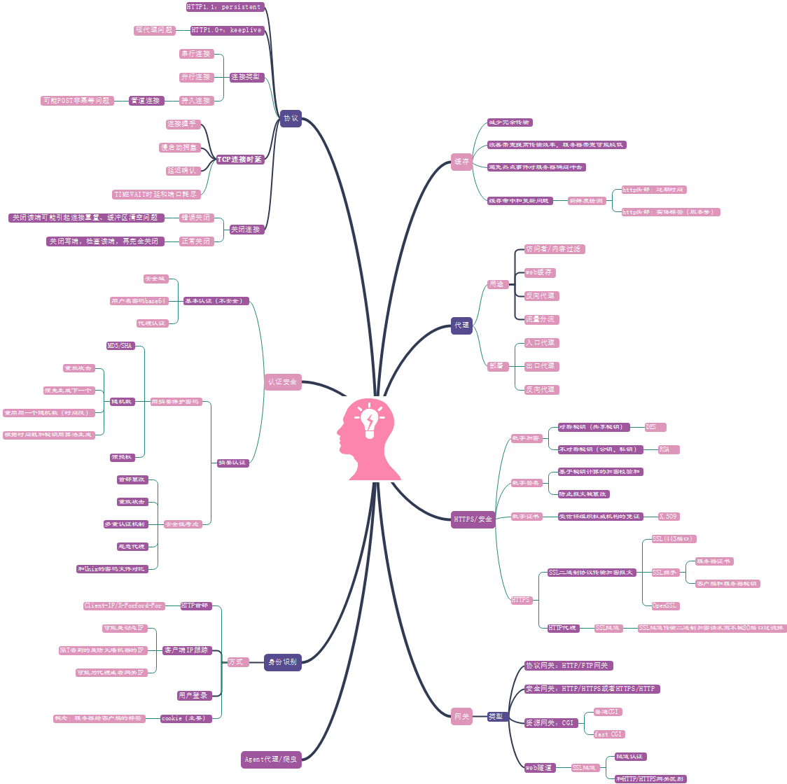

**浏览器原理**     
功能：从服务器请求web资源（HTML、图片、PDF、其他数据）并且展示在浏览器上。
主要的处理在渲染引擎：
工作流程：

**HTTP**    
HTTP (the protocol used by a browser to get web pages from a server)
翻译：浏览器通过http协议从服务器获取web页面

**API**    
API stands for "application program interface".It's just a documented method of interacting with someone else's service.
翻译：API是服务之间相互影响作用的接口。

**FAQ**   
1、http所谓的明文传输如何保证数据的安全性？  
答：    
2、代理和网关的区别？   
**答：** 代理连接的是多个相同协议的应用程序。http代理服务器既是服务器也是客户端。网关连接的是多个不同协议的应用程序，类似于协议转换器。   
3、web缓存为什么不能放在浏览器客户端来实现？   
答： 

**参考**    
1、HTTP    
https://book.douban.com/subject/10746113/    
https://book.douban.com/subject/25856314/   
2、浏览器原理   
https://www.html5rocks.com/en/tutorials/internals/howbrowserswork/   
https://coolshell.cn/articles/9666.html   
http://arvindr21.github.io/howBrowserWorks   