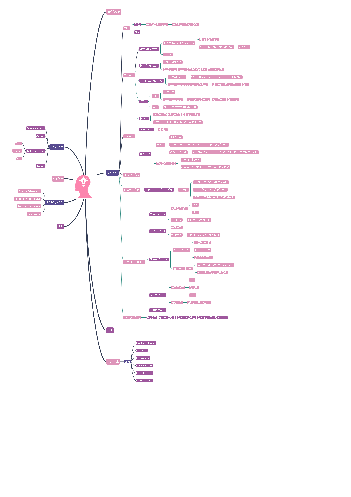

**用户管理**     

**linux**   

**参考**   
+ 《现代操作系统（第3版）》： https://book.douban.com/subject/3852290/   
+ 《深入理解计算机系统（原书第2版）》： https://book.douban.com/subject/5333562/   
+ 《Linux/UNIX系统编程手册》：https://book.douban.com/subject/25809330/     
+ Linux内核：https://xinqiu.gitbooks.io/linux-insides-cn/content/index.html      
+ Linux性能分析：http://www.brendangregg.com/linuxperf.html     