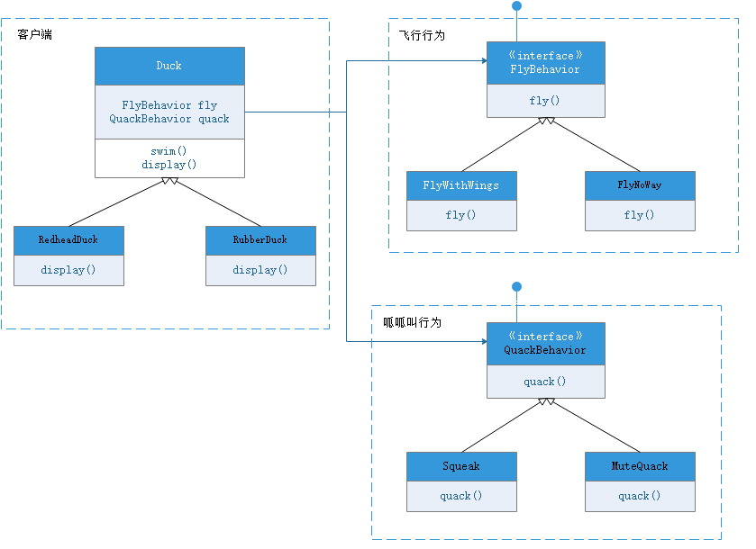
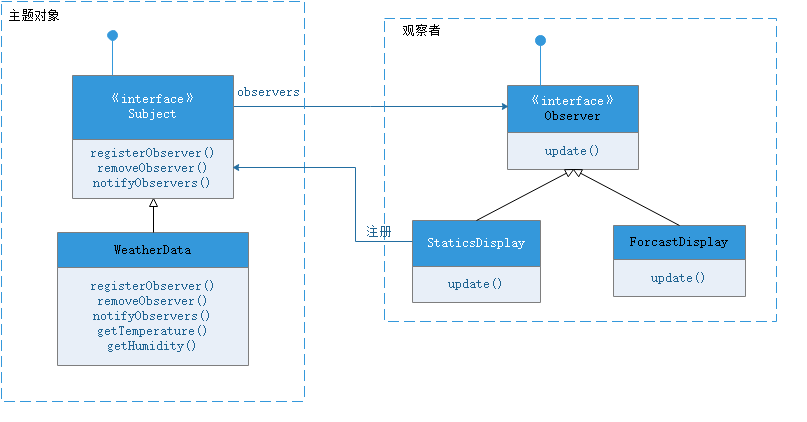

## **概念**     
+ 抽象      
+ 封装      
+ 继承      
+ 多态       

## **设计模式**     
+ 策略模式：算法。接口作为类成员变量，组合的方式实现不同行为的多态，由客户端决定使用哪种行为。      

+ 观察者模式：一对多。     
+ 1) 可能触发意外更新，因为所有观察者都收到通知。 
+ 2) 推/拉模型。    
+ 3) 推模型：目标主题向观察者发送关于改变的详细信息。     
+ 4) 拉模型：目标除最小通知外什么也不发，由观察者主动查询改变的详细信息。   
+ 5) 在观察者注册时，扩展注册接口，显示指定特定感兴趣的事件。      

## **OO原则**     
+ 封装变化，变化的部分单独用类或者虚函数抽离，考虑Head First第一章鸭子行为的例子           
+ 多用组合，少用继承       
+ 针对接口编程，不针对实现编程，考虑Head First第四章实例初始化的例子     
+ 交互对象松耦合，考虑Head First第二章气象站观察者模式             
+ 开放-关闭原则，类应该对扩展开放，对修改关闭，考虑Head First第三章定制咖啡的例子      
+ 依赖倒置原则，要依赖抽象，不要依赖具体类       

## **对比**     
+ 组合和继承：    
+ 面向过程和面向对象：利用对象和类的关系解决需求变化的问题        
+ 抽象类和接口的区别：    
+ 工厂方法和抽象工厂的区别：都是创建对象，工厂方法用的是继承，抽象工厂用的是对象的组合     
+ 工厂方法：3种版本创建披萨：1.工厂方法，2.抽象工厂，3.面向过程      
+ 适配器模式：考虑插座适配方式      

## **参考**     
入门经典：《Head First设计模式》     
灵活生动：《大话设计模式》       