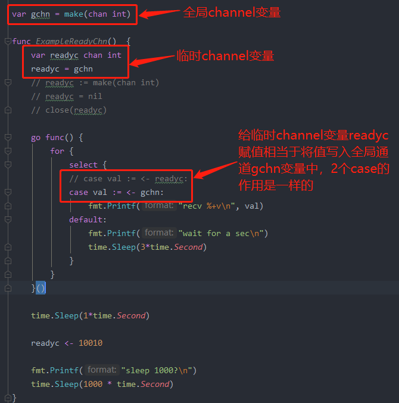
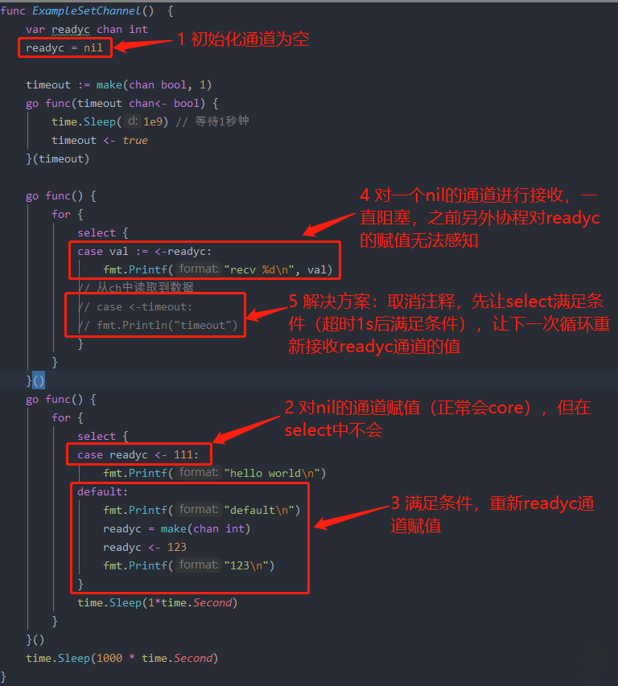
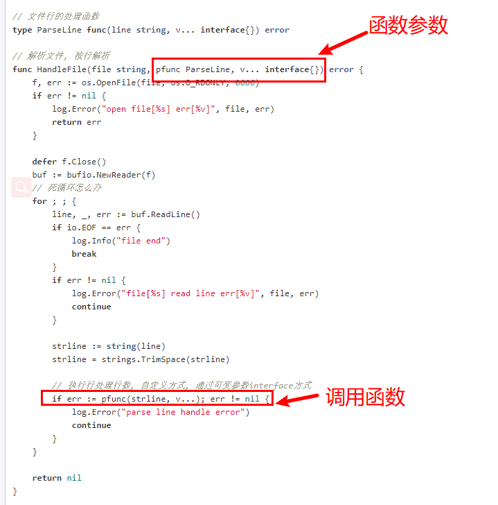
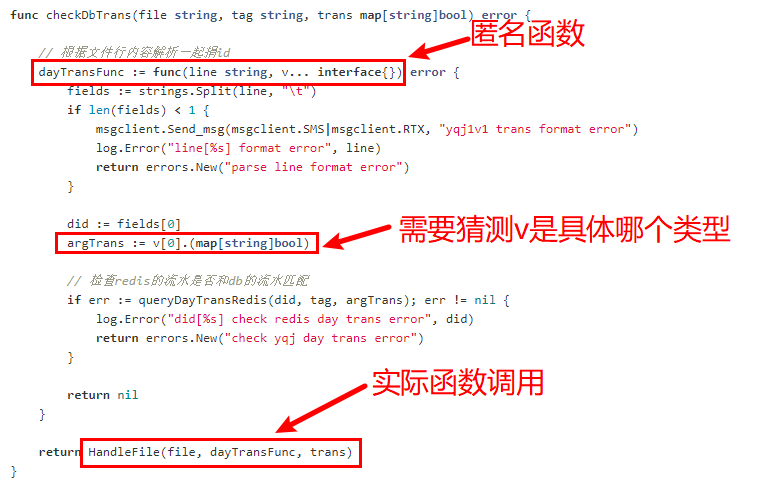
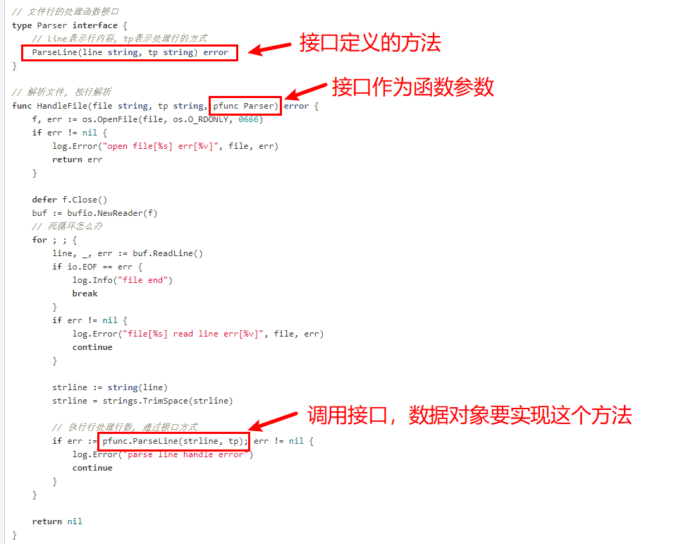
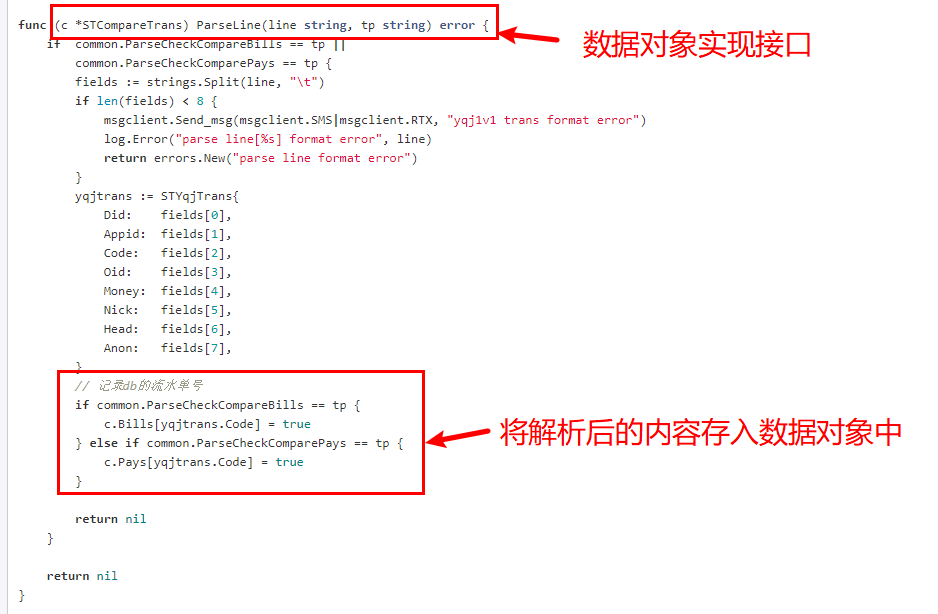

# **channel**  

+ **channel赋值为nil**   
1、channel可以赋值为nil，赋值为nil不能对通道写入数据，如果对nil的通道写数据会core，就像C++对一个指针为空的地址写数据会core类似。   
2、close一个channel和将channel赋值为nil不同，close后就永远不能再往通道写数据了，只能读。将一个channel赋值为nil，然后重新赋值为其他make(chan interface{})的值，channel可以继续正常读写。   
3、channel可以用临时变量赋值，有一个全局变量channel，用临时channel变量赋值给全局channel变量，对临时channel变量赋值相当于对全局channel变量赋值。   
   

+ **channel作为函数参数**   
说明：channel作为函数参数，一般用于其他go协程操作了通道，由本go协程来接收或者写入这个通道触发某些操作。   
示例1、2，channel作为函数参数，带end端点（方向）的参数意义更明确，提供更清晰的意图，另外编译器可以帮忙检查是否有语法错误。
示例3，没有指明end端点，说明2个端口（方向）的channel都可以作为参数。   
示例4，奇怪的用法，一般不采用。除非你想改变channel的值。这个时候通过返回channel可能会更适合。   
``` golang    
1、func serve(ch <-chan interface{}){ //do stuff }   
2、func serve(ch chan<- interface{}){ //do stuff }   
3、func serve(ch chan interface{})  { //do stuff }   
4、func server(ch *chan interface{}){ //do stuff }   
```
https://stackoverflow.com/questions/24868859/different-ways-to-pass-channels-as-arguments-in-function-in-go-golang   

+ **channel作为返回值**   


# **select**   
1、select中有异常的case不一定会捕捉到，只要有一个case满足条件就可以继续运行（例如增加默认default的case）。   
2、如果没有case满足条件，那么某个case可能会永远阻塞下去，例如一个go协程的select中只有一个接收通道的case，但是该通道在其他协程没有发送赋值，导致go协程的select无法触发下一次接收操作，可能导致该go协程永远阻塞。   
   

# **CSP Design**  

# **SOLID原则**    
+ 单一责任原则（Single Responsibility Principle）：类似于UNIX设计哲学，通过管道拼装不同的功能，go的package类似于unix的工具程序。     
+ 开放/关闭原则（Open / Closed Principle）：      
+ 大牛分析：https://dave.cheney.net/2016/08/20/solid-go-design       

# **函数**   
+ 大牛分析： https://medium.com/rungo/the-anatomy-of-functions-in-go-de56c050fe11         
+ 闭包分析： https://www.calhoun.io/5-useful-ways-to-use-closures-in-go/     
+ 闭包：闭包和匿名函数的区别？   
+ struct里面包含函数，具体的作用？       
+ **函数作为接口的实现者？**       

# **功能选项设计演进**   
类似C++多个构造函数的实现，go采用更通用的方法，设计灵活的配置参数实现多个构造函数（Functional options）。   
+ **大牛分析** ：https://dave.cheney.net/2014/10/17/functional-options-for-friendly-apis     
								 https://commandcenter.blogspot.com/2014/01/self-referential-functions-and-design.html   
								 https://blog.csdn.net/liyunlong41/article/details/89048382    
+ 问题1： 如果将所有参数列在函数参数中，所有参数变成必填，无法达到可选参数默认值的需求。   
``` golang
func NewServer(addr string, clientTimeout time.Duration, maxconns, maxconcurrent int, cert *tls.Cert) (*Server, error)
```
+ 问题2： 如果变成多个方式的构造函数，看起来会很冗余，调用者也很难挑选合适的使用方式。   
``` golang
func NewServer(addr string) (*Server, error)
func NewTLSServer(addr string, cert *tls.Cert) (*Server, error)
func NewServerWithTimeout(addr string, timeout time.Duration) (*Server, error)
```
+ 问题3：如果可选的配置参数是struct，因为对于端口参数默认值，赋值为零值会导致无法正常使用。      
``` golang
type Config struct {
	Timeout time.Duration
	Cert *tls.Certificate
}
func NewServer(addr string, config Config) (*Server, error) 
```
+ 问题4：如果config的struct参数为指针，传nil的意思是使用默认值参数？传nil和传空strcut的地址有什么区别？nil不应该作为参数传入函数中，否则对使用者造成歧义。并且这种方式有可能会修改config参数的内部？     
``` golang
type Config struct {
	Port int
}
func NewServer(addr string, config *Config) (*Server, error)
srv, _ := NewServer("localhost", nil)
config := Config{Port:9000}
srv2, _ := NewServer("localhost", &config)
config.Port = 9001 // 会发生什么?
```
+ 优化1： 通过可变参数config，改善构造函数以下几个地方，问题是调用者可能传多个可变的参数：   
1）避免了强制参数选项。默认构造函数可以不传config可变参数。   
2）避免nil或者空struct作为构造函数的默认参数，可以明确参数选项config的设置方式。   
3）避免\*config指针类型访问对象内部参数的实现。避免伪造修改参数本身。   
``` golang
func NewServer(addr string, config ...Config) (*Server, error)
srv, _ := NewServer("localhost") // 默认构造
srv2, _ := NewServer("localhost", Config{Timeout: 300*time.Second}) // 参数方式构造
```
+ 优化2： 通过可选配置函数的方式改善优化1存在的问题：每个参数通过函数的方式进行设置。避免调用者用优化1的方式可能传多个config的参数。   
``` golang
func NewServer(addr string, options ...func(*Server)) (*Server, error)
srv, _ := NewServer("localhost") // 默认构造
timeout := func(s *Server) { s.timeout = 60 * time.Second }
tls := func(s *Server) { config := loadTLSConfig() srv.listener = tls.NewListener(s.listener, &config) }
srv2, _ := NewServer("localhost", timeout, tls)

func NewServer(addr string, options ...func(*Server)) (*Server, error) {
	s := Server(listener:l)
	for _, option := range options {
		option(&s)
	}
}
```
+ 结论：通过可选配置函数方式初始化构造函数，提供更友好的API给调用者使用：   
1）明智的默认值    
2）灵活可配置    
3）配置参数可以动态添加    
4）良好的文档组织    
5）让调用者安全的使用   
6）不需要nil或者空struct，避免使用者混淆用法      

## **内嵌(embedd)**    
+ 大牛分析：https://golang.org/doc/effective_go.html#embedding        
                     https://github.com/bingohuang/effective-go-zh-en/blob/master/13_Embedding.md           
					 https://dave.cheney.net/2015/05/22/struct-composition-with-go         
+ 内嵌的理由：       
+ interface内嵌接口：内嵌接口让数据同时包含每个接口的功能，如果接口替换为列举所有方法，记忆不太方便。                    
+ struct内嵌接口：struct里面具有interface的功能。目的改变或者扩展接口的用法，通过数据赋值接口使数据扩展接口的用法。如果struct没有实现interface的接口，表示直接执行数据的接口行为，如果struct重新实现interface的接口，表示扩展或者改变数据的接口行为。                     
+ struct内嵌struct：除了类似C++继承的作用（使用内嵌struct的成员变量和方法）。 参考《go程序设计语言》P125内嵌说明。                    
``` golang
// interface内嵌接口：io package
// ReadWriter is the interface that combines the Reader and Writer interfaces.
// 目的：定义一个struct同时实现io.Reader和io.Writer的方法
type ReadWriter interface {
    Reader
    Writer
}
// struct内嵌接口：
// Reader implements buffering for an io.Reader object.
// 目的：Reader重新实现了io.Reader，表示扩展改变rd数据的行为。
type Reader struct {
	buf          []byte
	rd           io.Reader // reader provided by the client
	r, w         int       // buf read and write positions
	err          error
	lastByte     int // last byte read for UnreadByte; -1 means invalid
	lastRuneSize int // size of last rune read for UnreadRune; -1 means invalid
}
// struct内嵌struct：bufio package
// ReadWriter stores pointers to a Reader and a Writer.
// It implements io.ReadWriter.
// 目的：使ReadWriter具有Reader和Writer的方法，以及具有io.Reader和io.Writer的方法
type ReadWriter struct {
    *Reader  // *bufio.Reader
    *Writer  // *bufio.Writer
}
// struct内嵌struct：
// 1) 目的：使Job具有Logger的方法
type Job struct {
    Command string
    *log.Logger
}
job := &Job{command, log.New(os.Stderr, "Job: ", log.Ldate)}
job.Println("starting now...")
// 2) 目的：Job可以重新定义Logger的方法并进行覆盖
func (job *Job) Printf(format string, args ...interface{}) {
    job.Logger.Printf("%q: %s", job.Command, fmt.Sprintf(format, args...))
}
```

# **接口**   
+ 大牛分析： https://medium.com/rungo/interfaces-in-go-ab1601159b3a     
                      https://www.integralist.co.uk/posts/go-interfaces/          
					  https://www.youtube.com/watch?v=F4wUrj6pmSI&t=2320s        
+ **1、函数作为函数的参数和接口作为函数的参数有什么区别？**   
+ 问题描述：为解决减少重复代码，处理文件的方式都大同小异，需要按行读取每一行内容，然后按照一定格式解析每一行的内容，最后将解析后的数据存储到对应的数据对象中。原本的方式是每个业务代码拷贝相同的代理，然后修改处理具体逻辑，但是这样大部分代码都重复了，后来优化为通过函数指针和接口两种方式解决这个问题。
	+ 1.1 函数作为函数参数：类似C/C++的函数指针，然后通过可变参数v...interface{}作为函数指针的参数，缺点是对象数据通过可变参数传递，具体解析函数需要.(type)方式猜测对象数据的格式，可读性和易用性较差。   
		+ 1.1.1 定义函数参数   
		      
		+ 1.1.2 使用函数参数    
		      
	+ 1.2 接口作为函数参数：接口定义解析行的方法，接口作为函数的参数，然后业务中数据对象只要实现接口解析行的方法，这样解析后的数据很容易存储到业务对象中，接口参数类似C++的基类指针，然后调用接口的函数会具体调用到子类的继承函数，但是go不要求数据要有基类子类这样的继承关系，只要对象实现了接口，就可以赋值给接口并且使用接口的方法，可读性和易用性较强。  
		+ 1.2.1 定义接口    
		      
		+ 1.2.2 数据对象实现接口    
		      
+ **2、接口作为函数返回值（一般不建议?）**          
+ 参考sarama客户端NewConsumerGroupFromClient的实现（不合规范的做法？）       
+ 一般不建议接口作为函数返回值，那是java的做法class完全继承接口（显式接口），go的做法是struct包含接口（隐式接口），函数参数接受interface返回struct，如果直接返回接口，返回值的作用受限了，返回struct可以扩展其他interface的功能。      
+ 大牛分析： https://medium.com/@cep21/preemptive-interface-anti-pattern-in-go-54c18ac0668a     
					  https://www.integralist.co.uk/posts/go-interfaces/        
+ **3、接口作为struct的变量**        
+ 大牛分析：https://stackoverflow.com/questions/24537443/meaning-of-a-struct-with-embedded-anonymous-interface          
+ **4、接口分离原则(Interface Segregation Principle)**      
+ 大牛分析：https://dave.cheney.net/2016/08/20/solid-go-design       
+ go里面的准则是参数接受interface，返回struct的方式(不是返回interface)。      
+ A great rule of thumb for Go is accept interfaces, return structs.       
``` golang
// 笨挫方式：Save writes the contents of doc to the file f.
// 问题1：参数*os.File只允许写文件, 阻止将内容写入网络或者其他存储，操作受限。如果要扩展支持写网络，函数参数要改，所有调用的地方也要改。
// 问题2：参数*os.File同样定义了很多和Save不相关的方法，像目录方法和其他方法。实际上该参数应该只和相关的操作绑定(写操作)。
func Save(f *os.File, doc *Document) error

// 优化方式(接口隔离)：Save writes the contents of doc to the supplied Writer.
// 说明1：扩展应用，所有实现写接口的对象可以代替os.File
// 说明2：w不需要和不相关的方法关联，只和写操作进行绑定。
func Save(w io.Writer, doc *Document) error
```

# **标准库**   
## bufio：    
缓冲I/O库，目的是减少对实现的io.Reader和io.Writer接口的调用次数，如果io接口对应操作的是磁盘，则可以减少操作磁盘的次数。   
+ bufio.Writer，用于减少io.Writer接口调用，数据处理模型： producer --> buffer --> io.Writer，用户producer消息到bufio的buffer，当bufio的buffer满才触发一次调用io.Writer，用户实现的io.Writer接口可以是写文件（磁盘），打印终端，TCP数据传输等具体操作，对于实现写磁盘接口，这样可以减少大量零碎的磁盘写操作。  
+ bufio.Reader，用于减少io.Reader接口调用，数据处理模型：io.Reader --> buffer --> consumer，用户调用io.Reader将数据存到bufio的buffer中，然后使用者从buffer将数据取出，只要bufio的buffer有数据没取完，就不会触发下一次调用io.Reader的操作。   
示例：如果从磁盘读取10个字节，每次读取1个字节，会触发10次磁盘读操作，将bufio的buffer设置为4，只会触发磁盘3次读操作。   
+ bufio.Scanner: 待分析研究。。。   
+ bufio.Reader的WriteTo：待分析研究。。。   
+ 区别：   ReadBytes('\n')、ReadString('\n') 、ReadLine、Scanner?   
+ bufio作用：一般配合archive/zip、compress/*、encoding/*、net/http等标准库使用，用于提高数据传输性能。   
+ 大牛分析：https://medium.com/golangspec/introduction-to-bufio-package-in-golang-ad7d1877f762      

## sync：   
+ 大牛分析：https://medium.com/@teivah/a-closer-look-at-go-sync-package-9f4e4a28c35a          

## json： 
struct和json的关系，组装json时，包括允许struct字段为空或者跳过struct某个字段，就是动态的选择struct的fields，或者通过匿名struct的方式来重新组成新的json
 + 大牛分析：https://medium.com/random-go-tips/dynamic-json-schemas-part-1-8f7d103ace71
				      https://eager.io/blog/go-and-json/
					  
## protobuffer/pb:   
 常用pb协议的方式：将pb协议的数据写到kafka中，然后kafka消费者读取pb消息，然后再将解析后的数据存储到db和hbase中。   
 + pb数据的应用场景：由于需要检查修复数据，将pb的数据保存一份到redis队列了，然后由任务统一消费redis队列，生成一个统一的数据文件，如果直接写到文件中，由于分布式进程，文件会比较零散。 修复数据的时候，从文件取出需要数据，组装成pb的格式，重新写回kafka中。       
 + 方案一： proto.marshal  --> json.Marshal --> Redis List --> Write File --> Read Line -> json.Unmarshal --> proto.marshal --> kafka 。考虑用json格式存储pb数据内容： {"time":"20200101","key":"kafka-key","pb":"proto bin body"}，实际测试的时候发现go的encode/json库无法解析包含pb字段的二进制数据流。   
 + 方案二： proto.marshal --> Redis List -->  proto.Unmarshl --> jsonpb.Marshal --> Write File --> Read Line --> jsonpb.Unmarshal --> proto.marshal --> kafka。方案二的目的是保证数据文件每行都是可显字符的json串，因为如果数据文件是pb格式，那么文件解析pb不容易按行分隔解析，json串非常方便按行解析，json串也可以恢复回原来的kafka的pb数据，可以重新写回kafka中。   
 + 结论： jsonpb可以方便的将pb二进制数据转换为json字符串，不能直接用encode/json库将pb转成json串。    
 + pb协议解析：  https://medium.com/namely-labs/go-protocol-buffers-57b49e28bc4a     

## 杂项   
+ 协程id的获取(仅适合调试时使用)： https://blog.sgmansfield.com/2015/12/goroutine-ids/    
+ go语言面向对象设计： https://dave.cheney.net/2016/08/20/solid-go-design      
+ go推荐代码review： https://github.com/golang/go/wiki/CodeReviewComments#interfaces           

## defer     
+ defer执行的函数参数在初始化时已经确定了参数，不是在函数调用时才确定。      
+ defer按照LIFO的方式执行，如果一个函数有多个defer，最后defer的语句先执行。     

## 初始化数据make和new的区别     
+ new不初始化对象变量，只是将对象设置为零值。new返回对象的指针，var直接返回对象本身。     
+ go允许直接返回局部变量的地址，函数返回，局部对象的生存周期还存在。  
+ new(File) 等同于 &File{}        
+ make仅用于创建slice、map、channel类型，和new不同，make会初始化对象T，make初始化不是设置为nil值。    
+ make会初始化，如slice底层为数据指针，长度和容量，如果不初始化数据指针为有效值，则访问slice会core。    
+ make(T, args)返回对象对象T，而不是返回对象*T，new(T)会返回对象*T，注意make和new返回值的不同。    
 

**参考**  
  go相关博客列表： https://github.com/golang/go/wiki/Blogs     
《go编程语言》  ： https://book.douban.com/subject/26337545/   
官方effective go  ： https://golang.org/doc/effective_go.html   
go精华文章列表  ： https://github.com/golang/go/wiki/Articles      
go talk ：                 https://github.com/golang/go/wiki/GoTalks   
github上的go资源：https://github.com/avelino/awesome-go   
go编程规范 ：		 https://golang.org/ref/spec     
gopher meeting：   https://www.youtube.com/playlist?list=PLx_Mc4dJcQbl4qPWbVu86u6owZeiwsErR        


