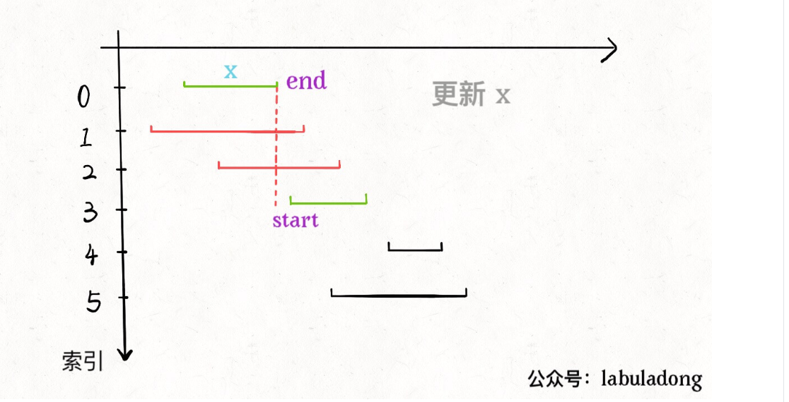

## **数据结构**    
+ 存储方式：顺序存储（数组）和链式存储（链表），链式存储不能随机访问。      
+ 遍历+访问：线性访问（for/while为代表）和迭代访问（递归为代表），访问是增删改查。         

## **递归**     
+ 过程实现：递归调用和普通函数调用是类似的。每次函数调用都有一个分离的活动帧保存当前的函数参数等栈信息，当前函数挂起，进入下一个函数调用。
+ 组成部分：基础条件base case返回固定值和递归条件recursive case。 
+ 关键要素：结束条件（第一行return）、规模更小子问题、父问题和子问题不应该有交集。                           
+ 应用例子：
	1）阶乘：n！=（n-1）！，表示n个数排列组合的所有情况。     
	2）英语规则：
	3）二分查找：通过折半递归查找目标值，如线性数组，缩小递归搜索范围。     
	4）文件系统：可以递归计算文件目录的大小，当前目录/文件大小+所有子目录的目录/文件大小。归纳为树的遍历。       
+ 线性递归：每次递归只调用一次递归函数。如阶乘例子和二分查找例子（二分查找只会走其中一个分支递归搜索）。递归数组求和以及递归反转数组都是线性递归的例子。            
+ 二叉递归：每次递归调用2次递归函数。  数组元素的累计和也可以分解为二叉递归的解法。空间复杂度和时间复杂度的计算？      
+ 多重递归：每次递归调用多次递归函数。如递归计算目录的大小。  
+ 递归函数设计： 考虑带参数的递归函数，参数对于分解子问题起到决定性作用。          
+ 注意区别低效的递归：       
   1）判断序列元素唯一性例子中，重复冗余的判断导致指数级的时间复杂度？             
   2）Fibonacci数列也可能存在低效递归？第n个Fibonacci数字F(n)=F(n-1)+F(n-2)，二叉递归，计算F(n-1)的时候，F(n-2)已经计算过了，计算F(n)的时候会再计算一次，导致计算的时间复杂度为指数级。消除这种情况的方法是把每次计算的结果保存下来，下次直接使用，采用数组保存每次序列的结果，最后返回一个数组，取出最后一个元素。         
   3）结论：需要注意递归函数调用的次数，尽量控制由n递减到1，避免重复冗余的递归调用（如计算F(n)依赖F(n-1)和F(n-2)，这样F(n-1)又重复计算了F(n-2)）,导致指数级的时间复杂度。       
+ 注意无限递归死循环：没有base case导致无法结束递归。避免无限递归必须意识到每次递归操作会趋向base case。        
+ 尾递归优化：尾递归主要对栈内存空间进行优化。一般递归需要回溯，尾递归不用回溯。利用栈转换成非递归的形式节省函数调用内存消耗。将线性递归转换为迭代方式？                                  

## **树**     
+ 前序遍历：先构造完全二叉树，从上到下和从左到右遍历，第1次遇到节点的时候将节点打印出来。     
+ 中序遍历：先构造完全二叉树，从上到下和从左到右遍历，第2次遇到节点的时候将节点打印出来。     
+ 后序遍历：先构造完全二叉树，从上到下和从左到右遍历，最后1次遇到节点的时候将节点打印出来。       
+ 前序后序遍历不能还原二叉树：中序前序或者中序后序才能还原二叉树，因为前序后序无法确认左右子树，只有中序能确认左右子树。          
+ 二叉树的左视图：首先要确认每个节点在哪层，然后通过前序或者层级遍历，并且用数组记录该层是否被访问过，先序或者层级遍历的时候，就可以打印左视图的节点。      
+ 确定节点属于哪一层：      
     

## **遍历（非递归）**    
+ T98 判断有效的二叉搜索树：递归判断每个节点的左右子树都是二叉搜索树，否则不是二叉搜索树，先判断根节点是否合法，再判断左右子树是否合法，容易犯的错误是判断完根节点，后面只递归判断左右子节点，并没有将当前节点和左右子树所有节点进行比较判断。              
+ 前序遍历     
   1）思路：每个节点D，都是出栈D（打印节点），然后按照R-->L的方式入栈，出栈的顺序就是前序遍历。       
   2）算法：利用1个栈，出栈1个节点，入栈2个子节点，先入栈右子节点，再入栈左子节点，出栈的顺序就是遍历的顺序。     
+ 中序遍历     
	1）思路：每个节点D，都是出栈最左节点（打印节点），然后指向节点的右子树，继续出栈最左节点，出栈的顺序就是中序遍历。     
	2）算法：利用1个栈和当前指针，左子节点不为空则入栈，找到最左子节点，就出栈，然后将当前赋值为出栈节点的右子节点，当前指针不为空则继续找左子节点，为空则出栈子节点，重复将当前指针赋值为出栈节点的右子节点。出栈的顺序就是遍历的顺序。         
+ 后序遍历       
	1）思路：      
		双栈法：前序遍历的变种，每个节点D，都是入栈D，然后按照R-->L的方式入栈，将出栈结果存放到另外一个栈中，实现逆序打印，出栈的顺序就是后序遍历。       
		单栈法1：出栈的时候检查右子树是否已经被访问了，用pair<Node,int>表示节点是否被访问过（1表示访问左子树，2表示访问右子树）。    
		单栈法2：前序遍历的变种。按照前序遍历，但是先入左子树，再入右子树，最后将结果逆序打印。                    
	2）利用2个栈S1和S2，根节点开始出栈，S1出栈的节点放到S2，然后将出栈节点的左右子节点放到S1中，然后再循环出栈1个节点。       
+ 层级遍历       
	1）思路：      
		BFS，队列方式，将树节点按照每层放入队列，每取出一个节点，就将该节点下一层的子节点放入队列中。           
		DFS，递归方式，在当前层存放节点，然后递归遍历下一层的左子树和右子树，每遍历一层就创建结果集，存放当前层的节点。      
	2）算法：利用队列，每出队一个节点，就将该节点的左右子节点放入队列中，出队的顺序表示层级遍历的顺序，原则是出队1个节点，入队2个子节点的节奏循环操作。     
+ 结论        
   1）利用栈完成树节点遍历，通过控制子节点入栈和出栈的顺序完成树的遍历。层序遍历利用队列。     
   2）二叉树非递归遍历属于深度优先搜索DFS，和图的DFS遍历类似，注意图还有广度优先搜索BFS。             
   3）二叉树层级遍历属于广度优先搜索BFS       
   4）DFS：深度优先，想象栈为垂直类型，最先的元素在栈底，所以适合DFS？     
   5）BFS：广度优先，想象队列为水平类型，先进先出，所以适合BFS?      
   
## **二分法**   
+ 应用场景：寻找一个数、寻找左侧边界、寻找右侧边界       
+ 框架流程： 
   1）搜索边界：left=0, right=nums.length - 1        
   2）搜索区间：[left, right]，注意两端都是闭区间           
   3）while条件： while (left <= right)      
   4）调整左右搜索范围：left = mid + 1，right = mid - 1       
   5）返回条件：满足 target  = nums[mid] 直接返回，不满足直接返回 -1         
+ 搜索左右边界：      
  1）满足 target = nums[mid] 时不返回，继续锁定左侧边界或者右侧边界。     
  2）最后检查left越界或者right越界的情况。      
+ 注意事项：      
  1）二分查找代码不要出现else，全部展开成else if     
  2）将搜索区间全都统一成两端都闭，只要改target = nums[mid] 条件处的代码和返回的逻辑，可以作为二分法通用的模板。        

   
##  **动态规划**      
+ 动态规划要素：重叠子问题、最优子结构、状态转移方程（状态n和状态n-1的关系叫状态转移）。       
+ 一般形式：求最值：最长递增子序列、最小编辑距离、凑零钱问题。        
+ 核心：穷举。对于重叠子问题，需要备忘录或者DP Table来优化穷举。       
+ 思考状态转移方程（最难实现）：明确[状态] --> 定义dp数组/函数的含义 --> 明确[选择] --> 明确base case。   
+ DP数组一般是一维DP或者二维DP        
+ 斐波那契数列： 
   1）考虑重叠子问题。f(20) = f(19) + f(18)，然后计算f(19)的时候f(18)又会重复计算。导致效率十分低下。         
   2）考虑自顶而下的画递归树，可以分析递归算法是否低效（是否包含重复计算）。      
   3）递归时间复杂度计算：子问题个数乘以一个子问题需要的时间。     
   4）带备忘录的递归：子问题的答案记录在备忘录（数组）中，遇到子问题先去备忘录查询是否已经计算过。       
   5）递归是自顶向下，动态规划是自底向上，用DP Table完成自底向上数值的计算，可以用数值迭代方式取代递归方式。                
+ T516 最长回文子序列：归纳法，二维DP，dp[i][j]表示s[i..j]的最长回文子序列的长度。定义状态转移方程 s[i]==s[j]：dp[i][j] = dp[i+1][j-1] + 2，s[i] != s[j]：dp[i][j] = max(dp[i+1][j], dp[i][j-1])，求dp[0][n-1]的值，然后初始化DP数组，根据DP的求值和来初始化DP数组部分值和选择DP数组的遍历方向（斜着遍历或者反向遍历）               
+ T300 最长递增子序列问题：归纳法，一维DP，定义状态转移方程 d[i] = max{d[i], 1 + d[j]} | nums[i] > nums[j], d[i]表示以i索引结尾的子序列的长度             
+ T1143 最长公共子序列问题（简称LCS）：归纳法，二维DP，一般用于两个字符串，dp[i][j]表示s1[1..i]和s2[1..j]，这两个字符串的LCS的长度，定义状态转移方程 s1[i]==s2[j]：dp[i][j] = dp[i-1][j-1] + 1，s1[i] != s2[j]：dp[i][j] = max(dp[i-1][j], dp[i][j-1])，返回dp[i][j]的值，初始化DP数组部分初始值和选择DP数组的遍历方向                               
+ T322 凑零钱问题：由于不限制重复使用同一种币种，所以状态变化只有金额，dp[n]表示金额为n时最少的币数， 定义状态转移方程 dp[n] = min{dp[n-coin]+1, coin in coins}，初始化DP数组，选择DP数组的遍历方向                   
+ T887 扔鸡蛋问题：归纳法，鸡蛋个数和楼层数量为2个状态，每次选择扔鸡蛋，鸡蛋碎没碎会导致状态变化，碎了：鸡蛋-1，测试楼层数为i-1，没碎：鸡蛋数不变，测试楼层数为n-i。二维DP，定义状态转移方程 dp[k][n] = min{1 + max(dp[k - 1][i - 1], dp[k][n - i])} | (1 <= i <= n)， k为鸡蛋数，n为楼层数，dp[k][n] 表示用k个鸡蛋测n层最坏情况最多需要多少次，初始化DP数组部分初始值和选择DP数组的遍历方向        
+ T198 打家劫舍问题： 房子索引是状态，抢和不抢是选择。归纳法，一维DP，dp[n]表示nums[0..n]房子最多抢的钱。定义状态转移方程 dp[n] = max(dp[n+1], nums[n] + dp[n+2])，初始化DP数组部分值和定义DP数组遍历方向（for循环反向遍历？）。            
+ T213 打家劫舍问题2：首尾相邻的房子不能抢（只抢首、只抢尾、首尾都不抢）。结果取max(rob(nums, 1, n-1), rob(nums, 0, n-2))的较大值，rob函数采用T198的动态规划方式求解。                       
+ T72 编辑距离：归纳法，二维DP，dp[i][j]表示s1[0..i]和s2[0..j]的最短编辑距离。定义状态转移方程 s[i]==s[j]：dp[i][j] = dp[i-1][j-1]（什么也不做），s[i] != s[j]：dp[i][j] = min(插入，删除，替换) + 1，插入为dp[i][j-1]，删除为dp[i-1][j]，替换为dp[i-1][j-1]，最后确认二维DP数组的部分初始值和DP数组的遍历方向，扩展延伸，如果需要操作步骤，可以将DP数组添加一个属性表示为操作步骤，每个DP数组元素都记录了操作步骤。                                                  
+ T70 爬楼梯问题：     
+ T139 单词切断问题：    
+ T121 股票买卖问题：状态转移方程： d[i][k][0] = max(d[i-1][[k]][0], d[i-1][k-1][1] + price[i]), d[i][k][1] = max(d[i-1][[k]][1], d[i-1][k-1][0] - price[i]), i表示天数，k表示最多交易次数，最后一个下标0表示没持股票，1表示持有股票，d[3][2][0]表示第3天没有股票最多交易2次的利润最大值。k固定为1时，可以去掉一维变为二维，base case：d[-1][0] = 0，表示没有交易，利润为0，d[-1][1]=负无穷，表示没有交易持有股票是不可能的，利润为负无穷。         

## **栈**   
+ T20 括号匹配：遍历字符串所有字符，利用栈，左括号入栈，右括号则判断栈顶元素是否匹配左括号，匹配则出栈，最后栈为空表示括号匹配。      

## **排序**     
+ T179 数组每个数字拼接最大的整数（字符串表示）：先将数组的数字排序sort（自定义函数：to_string(a) + to_string(b) > to_string(b) + to_string(a)），表示数组的数字按照拼接字符串的最大值进行排序，排序后，然后遍历数组，将数组的数字转换为字符串并进行合并。      
+ T215 找最大第k个数：先将数组排序（手写快排或者堆排序），然后取出第k个元素表示第k最大的数字。    

## **贪心**   
+ 区间算法思想图：     
          
T455 分配饼干：饼干和胃口都从小到大排序，优先满足胃口小的小孩，然后再满足胃口大的小孩。    
T435 不重叠区间：从终点的贪心算法。首先根据终点对区间排序，然后遍历区间，如果区间重叠，则删除当前区间，这样可以求得最大不相交区间。         
T452 射气球：跟不重叠区间一样，只是边界条件不一样，区间end==start时气球会爆，所以最少的弓箭为不相交区间的个数最大值。    
T406 重拍身高队列：先排身高更高的，这是要防止后排入人员影响先排入人员位置，每次排入新人员[h,k]时，已处于队列的人身高都>=h，所以新排入位置就是people[k]。考虑将这群人依次加入新队列中，加入时需符合k的要求。注意到，一个人的k值实际上与身高更矮的人的位置无关，所以如果身高比之更高的人已经排好队了，这个人加入这个新队列的位置就可以根据k值确定了。因此，身高较高的人应该先加入，我们先对队列按身高降序排序。此外，对于相同身高的人，k值较小的人位置在前，优先加入。     

作者：key_destiny
链接：https://leetcode-cn.com/problems/queue-reconstruction-by-height/solution/406gen-ju-shen-gao-zhong-jian-dui-lie-tan-xin-suan/
来源：力扣（LeetCode）
著作权归作者所有。商业转载请联系作者获得授权，非商业转载请注明出处。

## **回文**             
+ T5 最长回文子串（回溯-多叉树的遍历，类似动态规划的暴力解法）：区分字符串长度为奇数和偶数的情况，遍历字符串每个字符，以位置（i,i）对应字符串长度为奇数，和位置（i,i+1）对应字符串长度为偶数向两边扩展，找出最长的回文子串，如果发现更长的回文子串，则更新结果。      

## **回溯法**    
+ T6 数组全排列：  
+ T131 分割回文串：路径（属于回文子串），选择列表（每次分隔的子串），结束条件（字符下标到达结束）。    
	  
## **滑动窗口**      
T76 字符串最小滑动窗口：左右指针，右指针向右滑动扩大窗口，直到匹配子串，然后左指针向右滑动缩小窗口，如果子串不匹配，则右指针继续向右滑动窗口，匹配子串后记录最小的窗口大小。判断子串是否匹配可以通过两个哈希表needs和windows，记录每个字符的次数，needs表示目标字符字符的个数，windows表示窗口中字符的个数，每个字符个数都相等时表示子串匹配成功，就可以移动左指针缩小窗口继续匹配了。        
T3 计算最长不重复字符子串的长度：使用window作为计数器记录字符出现次数，先向右移动窗口，当window出现重复字符时，开始移动left缩小窗口，直到不满足重复字符，继续向右扩大窗口，如此反复，找到最大的子串长度。             

## **位操作**    
T136 单独的数字：两个相同的数字异或为0，所以遍历全部的数字可以得出单独的数字。      

## **两个指针**     
+ T5 最长回文子串： 双指针来确认一个字符串的回文子串（从中间向两边扩散判断回文串），然后针对字符串每个字符位置计算回文子串。回文串长度可能是奇数aba或者偶数abba，所以中心位置有两种s[i]、s[i]和s[i+1]          
+ T141 环形链表：使用双指针，一个指针每次移动一个节点，另一个指针每次移动两个节点，如果存在环，则两个指针一定会相遇。     
+ T392 判断子序列：双指针。第1个指针在a序列，第2个指针在b序列，移动两个指针，判断b是否为a的子序列。                       
+ T524 通过删除字母匹配最长子序列：辅助函数：判断字符串是否为子序列（两个指针，分别指向不同字符串），然后针对数组里每个字符串，判断是否为子序列，找出最长的子序列。如果子序列长度相同，则比较两个字符串的大小。        
+ T42 接雨水：      
+ 1）暴力解法：针对每个位置i，找出左边最高left_max和右边最高right_max，该位置能接的雨水为 min(left_max,right_max) - height[i]        
+ 2）备忘录解法：提前计算出每个位置的左边最高和右边最高（左边最高计算数组从左往右遍历，右边最高计算数组从右往左遍历），用数组记录下来。然后遍历每个位置i计算所有能接雨水总和。         
+ 3）双指针解法：       
+ T167 两数之和：针对有序数组，左指针指向较小元素，右指针指向较大元素，如果两数之和小于target，则左指针向右移动，如果两数之和大于target，则右指针向左移动，直到找到匹配的和。     
+ T633 两数平方和：左指针left从0开始递增，右指针right从sqrt(x)开始递减，如果满足left的平方+right的平方=x，表示满足条件，直到左指针和右指针相遇。    
+ T680 验证回文字符串：最多删除一个字符判断是否为回文串，编写辅助函数判断是否为回文串(左指针和右指针)，然后从左边删除一个字符或者从右边删除一个字符判断是否为回文串。     
+ T88 归并两个有序数组：   
   

## **参考**      
+ leetcode经典分析： https://github.com/labuladong/fucking-algorithm            
+ 著名经典教材：《算法（第4版）》      
+ 著名经典教材：《Data Structures and Algorithms in Java 6》，递归讲解深刻       
+ Youtub视频教程：TECH DOSE系列，搜索tree        
   https://www.youtube.com/watch?v=K2ybI-GEHSY&list=PLEJXowNB4kPzqcnf9CnjEcgP7r5LaSijB&index=1            
+ 数据结构入门：《大话数据结构》     
+ 数据结构和算法：https://github.com/CyC2018/CS-Notes/blob/master/notes/Leetcode 题解 - 目录.md     
+ 算法和数据结构书籍推荐：https://www.zhihu.com/question/21628833      
+ 高频题目整理：https://github.com/xizhengszhang/Leetcode_company_frequency         
+ 力扣解析：https://leetcode-cn.com/problems/super-egg-drop/solution/ji-dan-diao-luo-by-leetcode-solution-2/        
    