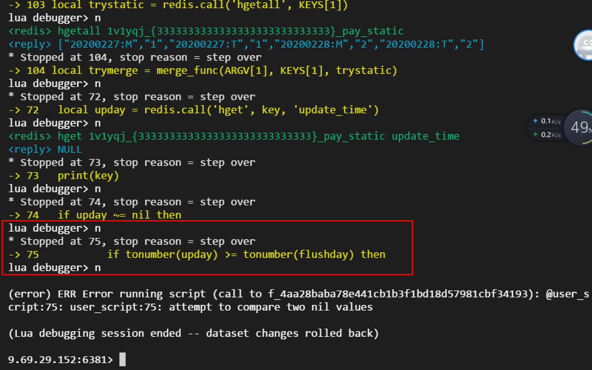

**lua调试**   
+ 终端调试命令： redis-cli -h xx.xx.xx -p port -c --ldb --eval yyy.lua  redis_key  ,  args     注意key和参数注意用逗号(逗号前后都要有空格)分隔。   
+ 检查lua脚本的luasha值是否保持不变，避免内存泄露。   
+ 注意redis返回值和lua值的映射关系。redis返回值为空的不同判断。   
``` lua
-- 对于hgetall命令，返回值是否为空可以采用table数组长度是否为0判断, kvs为redis的返回值 
local kvs = redis.call('hgetall', KEYS[1])
if table.getn(kvs) <= 0 then
	return -1
end

-- 对于hget命令，返回值是否为空可以采用bool方式判断（参考官网?）
local flag = redis.call('hget', key, days[i]..sep)
if false == flag then
	return -1
end
```
+ 直接采用单步调试lua脚本，类似gdb的方式调试C程序，不过好像没有跳出函数，只能单步每一行代码...   



**参考**    
官网调试文档： https://redis.io/topics/ldb            https://redis.io/commands/eval